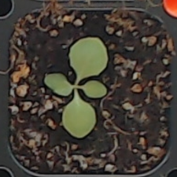

# An Automated, High-throughput Plant Phenotyping System using Machine Learning-based Plant Segmentation and Image Analysis

## Raw image

## Training image
 

## Preprocessed and segmentation image
  

## Preprocessed result folder

## Segmentation result folder

## Visualization

## Usage