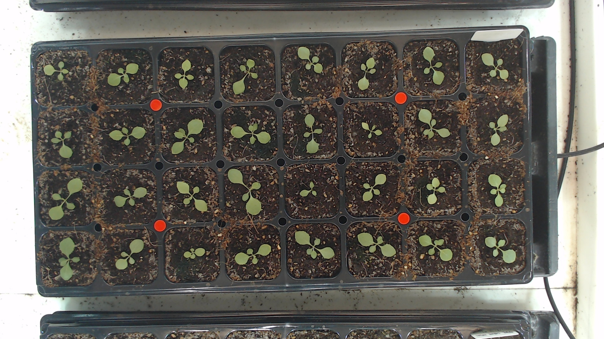
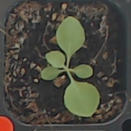
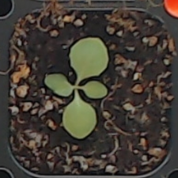
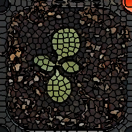
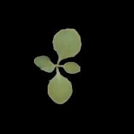
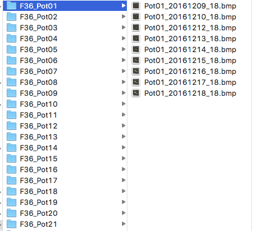
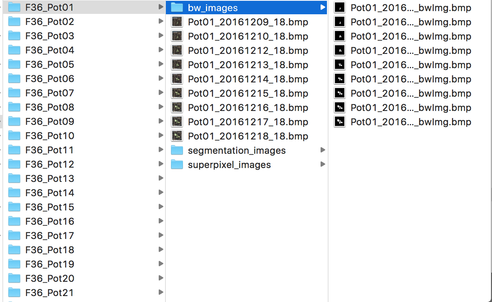
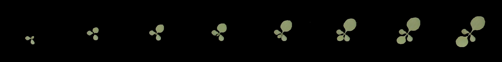
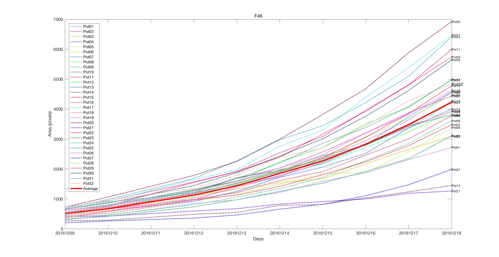

## Introduction
- An Automated, High-throughput Plant Phenotyping System using Machine Learning-based Plant Segmentation and Image Analysis
## Folder structure
```
├── image_acquisition
│   ├── db_analysis_computer_side.py
│   ├── raspberry_side.py
│   └── sync.sh #sync images betwwen db_analysis_computer and raspberry pi
├── image_processing
│   ├── analysisResult 
│   │   └── README.md
│   ├── raw_data
│   │   └── README.md
│   ├── test_data
│   │   └── README.md
│   ├── train_data
│   │   └── README.md
│   ├── trainingResult
│   │   ├── training_rf.mat
│   │   ├── training_slicParameters.mat	
│   │   └── training_superpixelData.mat
│   ├── vlfeat
│   ├── draw_contours.m
│   ├── preprocessing.py
│   ├── subdir.m
│   ├── test.m
│   ├── training.m
│   └── visualization.m
└── README.md
```
## Development environment
- Image acquisition
	- pyserial 3.4
- Preprocessing
	- Python 2.7
	- OpenCV 3.1.0 (python)
	- Numpy 1.11.3
	- imutils 0.4.5
- Training, segmentation, visualization
	- Matlab R2016b (9.1)
	- VLFeat -- Vision Lab Features Library 0.9.20

## Usage


## Raw image


## Training image
 

## Preprocessed / superpixel / segmentation image
  

## Preprocessed result folder


## Segmentation result folder



## Visualization



