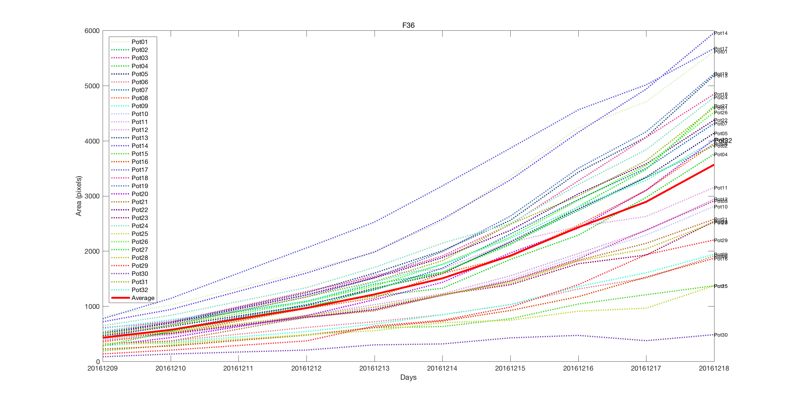

# An Automated, High-throughput Plant Phenotyping System using Machine Learning-based Plant Segmentation and Image Analysis

## Raw image

## Training image
 

## Preprocessed / superpixel / segmentation image
  

## Preprocessed result folder

## Segmentation result folder

## Visualization

## Usage
.
+-- _config.yml
+-- _drafts
|   +-- begin-with-the-crazy-ideas.textile
|   +-- on-simplicity-in-technology.markdown
+-- _includes
|   +-- footer.html
|   +-- header.html
+-- _layouts
|   +-- default.html
|   +-- post.html
+-- _posts
|   +-- 2007-10-29-why-every-programmer-should-play-nethack.textile
|   +-- 2009-04-26-barcamp-boston-4-roundup.textile
+-- _data
|   +-- members.yml
+-- _site
+-- index.html